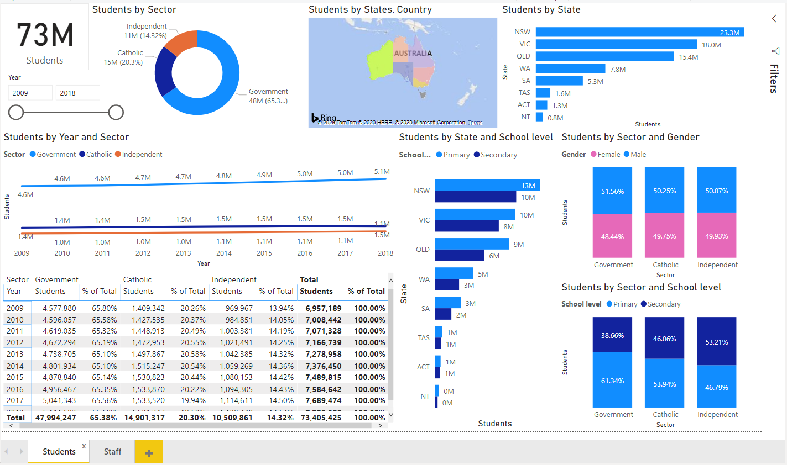
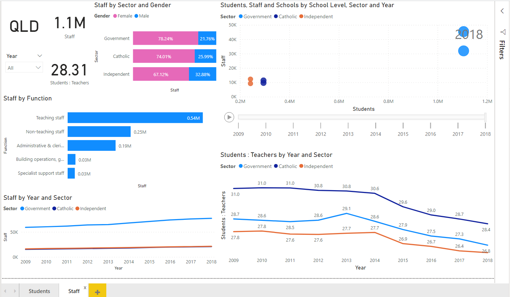

# School-and-Staff-Data-Analysis-using-PowerBI
Creating a dashboard for reporting with in-depth drilling and customization of historical datasets of school datasets from 2009 to 2018

The data comes from 30 csv files:
Each Entity has a 10 years worth of data:

Entities:
1. Student
2. Staff
3. Schhol

Using multiple csv files giving data based on each year and combining the files to create a data source.

## Student Dashboard

### Details

Student Demographic details based on Region, Gender, School Sector, Level of Education and States

Timeline: 2009 - 2018

## Staff Dashboard

### Details

Staff Demographic details based on Gender, Function, School, Sector and Student:Teacher Ratio

Timeline: 2009 - 2018
